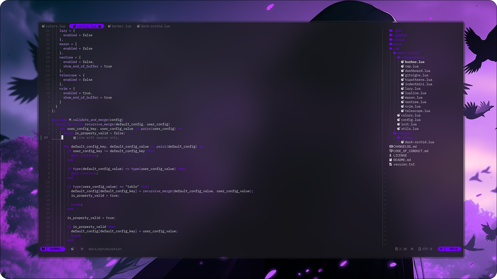

<div align="center">
  
  <h1>Dark Orchid for NeoVim</h1>

  A [NeoVim](https://neovim.io/) Colorscheme, that's purple.

  The Dark Orchid Theme is a cohesive visual ecosystem built around the striking color purple. Centered on the rich Dark Orchid shade, it highlights purple's depth, creativity, and elegance. Through balanced contrasts and unified tones, the theme creates a bold yet harmonious aesthetic that stands out across any design.

  *If you like this project, consider giving it a ⭐ to show your support!*<br/>
  *It also helps others to discover it.*

  [](../../releases/latest)
  [](./LICENSE)
  [](../../issues/new/choose)
  [](https://github.com/sponsors/simonkovtyk/)
</div>



## Features
- Supports latest NeoVim Features (>= 0.11.0)
- Fully Transparent
- Many Plugin Integrations
- It's purple

## Plugin Integrations
- [barbar](https://github.com/romgrk/barbar.nvim)
- [nvim-cmp](https://github.com/hrsh7th/nvim-cmp) (all plugins: nvim-cmp, cmp-cmdline)
- [dashboard-nvim](https://github.com/nvimdev/dashboard-nvim)
- [gitsigns.nvim](https://github.com/lewis6991/gitsigns.nvim)
- [mini.hipatterns](https://github.com/echasnovski/mini.hipatterns)
- [indentmini.nvim](https://github.com/nvimdev/indentmini.nvim)
- [lazy.nvim](https://github.com/folke/lazy.nvim)
- [lualine.nvim](https://github.com/nvim-lualine/lualine.nvim)
- [mason.nvim](https://github.com/mason-org/mason.nvim)
- [neo-tree.nvim](https://github.com/nvim-neo-tree/neo-tree.nvim)
- [telescope.nvim](https://github.com/nvim-telescope/telescope.nvim)

## Usage
Install Dark Orchid with your favorite Plugin Manager.

For Example with [lazy.nvim](https://lazy.folke.io/installation):
```lua
return {
  "dark-orchid/neovim",
  lazy = false,
  priority = 1000,
  opts = {},
}
```
After installing Dark Orchid with your Choice of Plugin Manager, you can enable this Theme in 2 Ways.

*by `init.lua`*
```lua
vim.cmd.colorscheme("dark-orchid")
```

*by NeoVim Command*
```shell
:colorscheme dark-orchid
```

## Configuration
### Integrations
> [!IMPORTANT]
> Since this Plugin should only activate necessary Integrations, only NeoVim is activated by default.
> 
> To enable other Integrations, follow the Steps below.
1. Go to the [Integrations Directory](./lua/dark-orchid/integrations/)
2. Remember the Plugin filename from this Directory, you want to active Integration for
3. Enable the Plugin Integration:
```lua
return {
  "dark-orchid/neovim",
  lazy = false,
  priority = 1000,
  opts = {
    integrations = {
      plugin_name_without_lua_extension = {
        enabled = true
      }
    }
  }
}
```
Change `plugin_name_without_lua_extension` with the actual Plugin filename from the given Directory, but WITHOUT lua file extension (.lua).

## License
The MIT License (MIT) - Please have a look at the [LICENSE file](./LICENSE) for more details.

## Contributing
Contributions are always welcome and greatly appreciated. Whether you want to report a bug, suggest a new feature, or improve the documentation, your input helps make the project better for everyone.

Feel free to submit a pull request, issue or feature request or start a discussion.

### Issues and Feature Requests
Reporting an issue or creating a feature request is made by creating a new issue on this repository.

You can create a [new issue or feature request here](../../issues/new/choose).

### Pull Requests
GitHub offers a solid guideline for contributing to open source projects through pull requests, covering key practices. These best practices provide a reliable starting point for making effective contributions.

You can find the [guidelines here](https://docs.github.com/get-started/exploring-projects-on-github/contributing-to-a-project).

### Code Of Conduct
We are committed to keeping a welcoming, inclusive, and respectful community for everyone. To help us achieve this, we kindly ask that you adhere to our [Code of Conduct](./CODE_OF_CONDUCT.md).

## Legal

All trademarks and registered trademarks mentioned are property of their respective owners and are used for identification purposes only. Use of these names does not imply endorsement or affiliation.

This project is a trademark of Dark Orchid. The License does not grant rights to use the trademark without permission.

© 2025 — present by The Dark Orchid Maintainers
